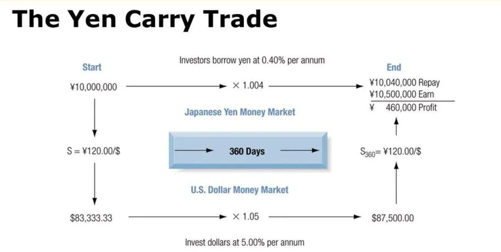
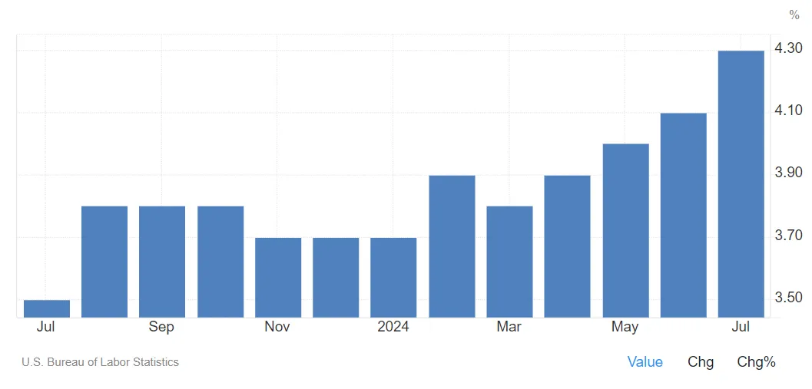
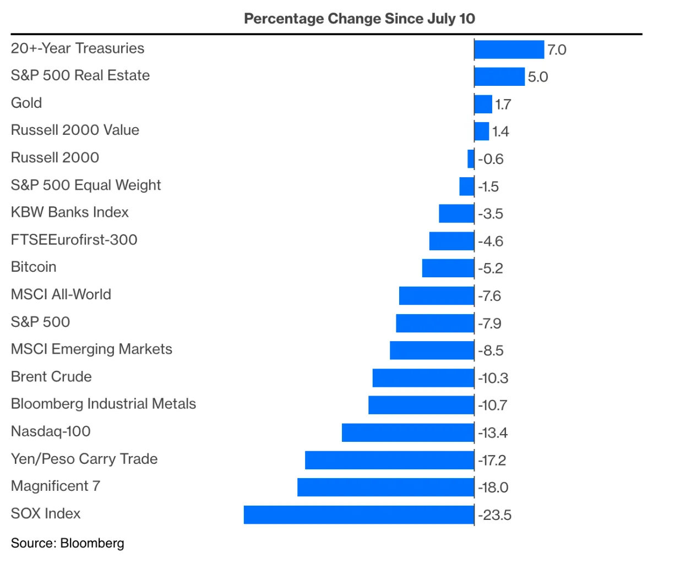
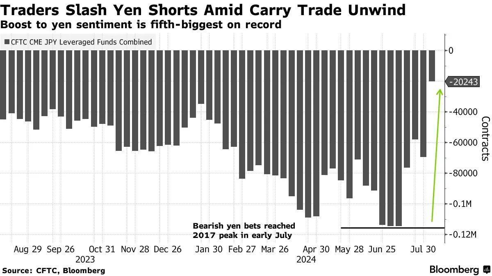
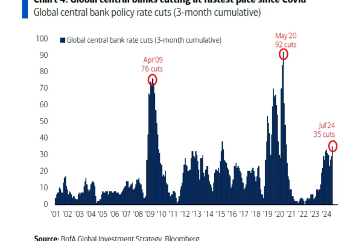
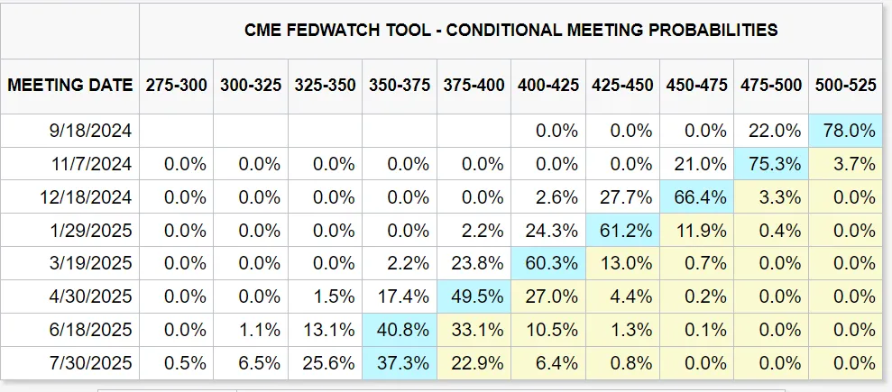
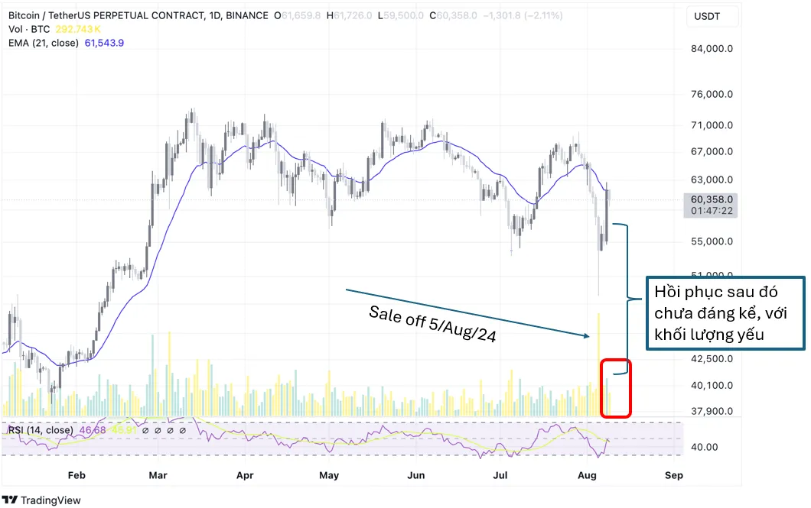

### Unwind Yen Carry Trade (Giao dịch chênh lệch lãi suất)

Rất nhiều năm, Nhật Bản duy trì chính sách lãi suất cực thấp. Các nhà đầu tư vay đồng Yên ở lãi suất thấp sau đó đổi yên qua các đồng khác có lãi suất cao hơn và có tỷ giá hối đoái ổn định; trong đa số trường hợp đó là USD. Sau đó dùng đồng USD đầu tư vào những lịch vực đang có tỷ suất lợi nhuận cao như cổ phiếu công nghệ, AI…

Bên dưới là ví dụ về việc sử dụng chiến thuật Yen Carry Trade trong một năm khi mà đồng Dollar với lãi suất 5% một năm so với 0.4% của Yên Nhật.

Cuối tháng 7 vừa qua, BOJ (Bank of Japan) tăng lãi suất 0.25% và bắt đầu đẩy giá đồng Yên đi theo chiều ngược lại, buộc các nhà đầu tiên theo chiến thuật Yen Carry Trade phải thanh lý tài sản để revert ngược lại đồng Yên. Rất ngắn trong cùng thời gian đó, dữ liệu kinh tế xấu từ Mỹ làm tăng triển vọng cắt lãi suất của Fed và đẩy giá trị USD đi xuống so với JPY.

Cùng với đó tỷ lệ thất nghiệp tăng lên 4.3%, tác động khả năng rất lớn là FED sẽ cắt lãi suất ở kỳ họp sau.Điều đó đồng nghĩa với việc đồng Yên tăng giá so với USD làm cho chiến thuật Yen Carry Trade trở nên rủi ro hơn bao giờ hết. Nhà đầu từ bắt đầu thoát vị thế và unwind lại đồng Yên. Hàng loạt thị trường chứng khoán trên thế giới đối diện với panic sale vào ngày thứ hai 5 Aug 2024 được Bloomberg gọi là đợt bán tháo lớn trên thị trường giống năm 1998, kể từ mốc công bố CPI ngày 11 tháng 7 đã có sự thay đổi giá vô cùng lớn.Ngay sau đó, 60% vị thế giao dịch bằng chênh lệch lãi suất được đóng trong ngày thứ 2, cùng với việc đa số broker Mỹ gặp lỗi kỹ thuật đăng nhập đã làm ngăn chặn đà sell off trong ngày hôm sau, từ thứ ba trở đi chứng kiến hồi phục ngắn hạn trên tất cả thị trường từ stock đến thị trường tiền kỹ thuật số.

Chúng ta hiện thời chưa có dữ liệu rằng những nhà đầu tư Bitcoin có sử dụng chiến thuật này hay không nhưng với việc Bitcoin ETF được giao dịch & được phân loại như những cổ phiếu công nghệ ở mức độ nhất định nào đó với tỷ lệ rủi ro cao được ưa thích bởi những nhóm nhà đầu tư trẻ tuổi thì BTC cũng không tránh được sự panic sale mạnh mẽ vào ngày thứ hai tuần này có lúc lên tới -16% trước khi hàng loạt biện pháp tác động vào thị trường từ BOJ sau đó phục hồi về mức -7.2% ở ngày thứ hai mùa hè sell off.

### Nguy cơ Mỹ suy thoái; Regime change trên thị trường tài chính.

Dữ liệu thất nghiệp lên mức cao 4.3% cùng với sự yếu đi của những chỉ số sản xuất làm dấy lên lo ngại rằng nước Mỹ đã bước vào giai đoạn suy thoái; một số ý kiến còn nêu rằng FED hãy cắt lãi suất ngay lập tức thay vì phải đợi đến kỳ họp sau trong tháng 9.

Sự xoay trục trong chính sách của các ngân hàng lớn sau khi thắt chặt lãi suất trong gần 2.5 năm vừa qua bao gồm cả những nền kinh tế lớn như khối EU, UK, Canada, Thụy Sỹ, Thụy Điển do lo sợ suy thoái ngày một tăng cao.Thị trường tài chính Mỹ đang rất mong đợi vào những đợt cắt lãi suất trong thời gian tới và theo dõi sát sao là nước Mỹ đã rơi vào suy thoái hay chưa, mới nhất là dự đoán từ JP Morgan với 35% Mỹ sẽ suy thoái trong năm 2024.

Giá Bitcoin giảm mạnh kéo theo sự trượt dài của altcoin.

Trong tuần qua giá BTC đã có lúc sụt giảm tới gần 16% trong ngày thứ 2 sau đó là tiếp diễn các đợt hồi phục nhẹ với tín hiệu buy không mạnh như kỳ vọng.

Chiến thuật giao dịch trong ngắn hạn và tuần tới của OneBlock là tìm kiếm một lệch short và đợi BTC kiểm tra lại vùng giá thấp hơn trước khi nghĩ đến việc open Long position cho BTC.

Cùng với việc sụt giảm của BTC trong thời gian qua thì các đồng altcoin từ công nghệ đến meme đều không có được performance tốt thậm chí đã lùi rất sâu trong sự tương quan với sự sụt giảm của BTC như cái layer-2 công nghệ mới được public token trong khoảng thời gian ngắn trước điển hình như OP, ARB,… OneBlock hiện tại chưa giữ bất kỳ một đồng coin nào cho chiến lược nắm giữ dài hạn. Chúng tôi thấy hiện tại thị trường altcoin với nhiều rủi ro chưa phải là thời điểm thích hợp để entry. Trong một bài viết khác đội ngũ team sẽ phân tích kỹ hơn về điều này.
